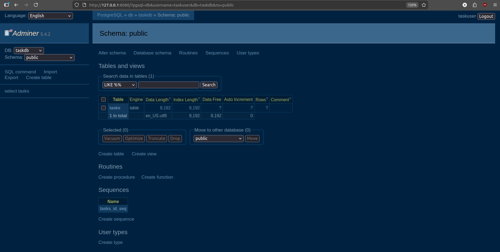
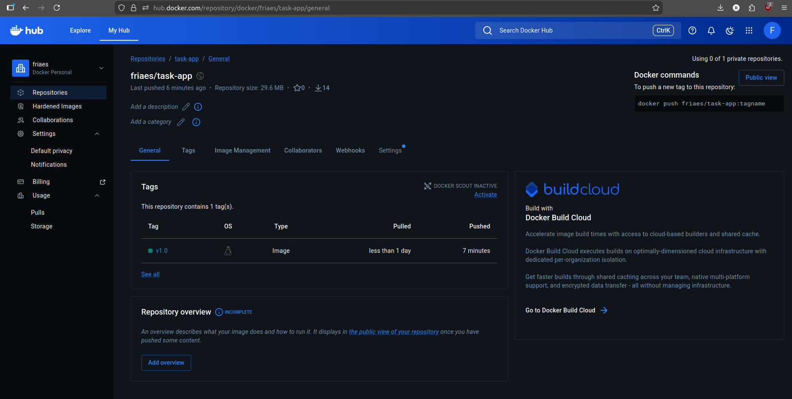
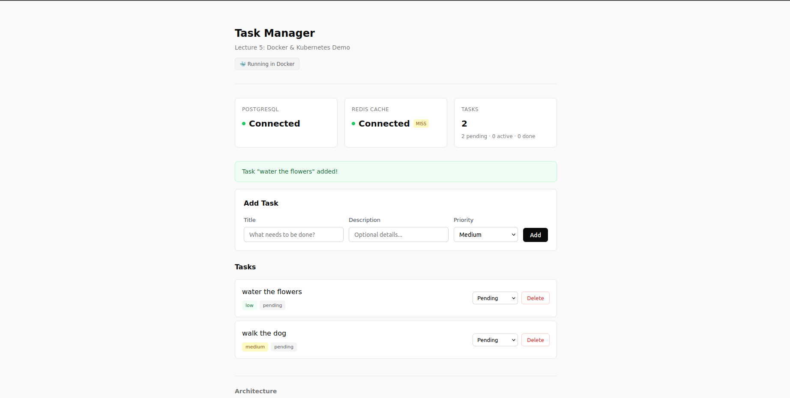
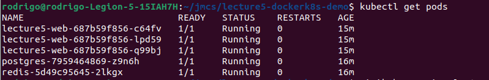
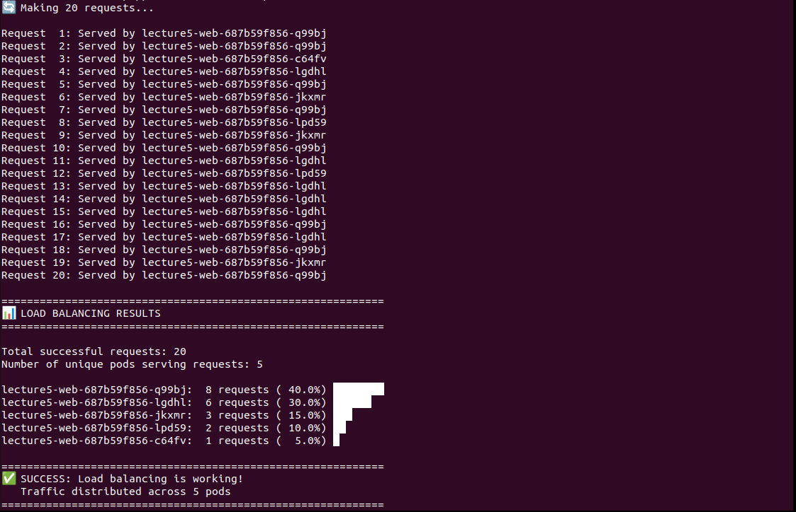
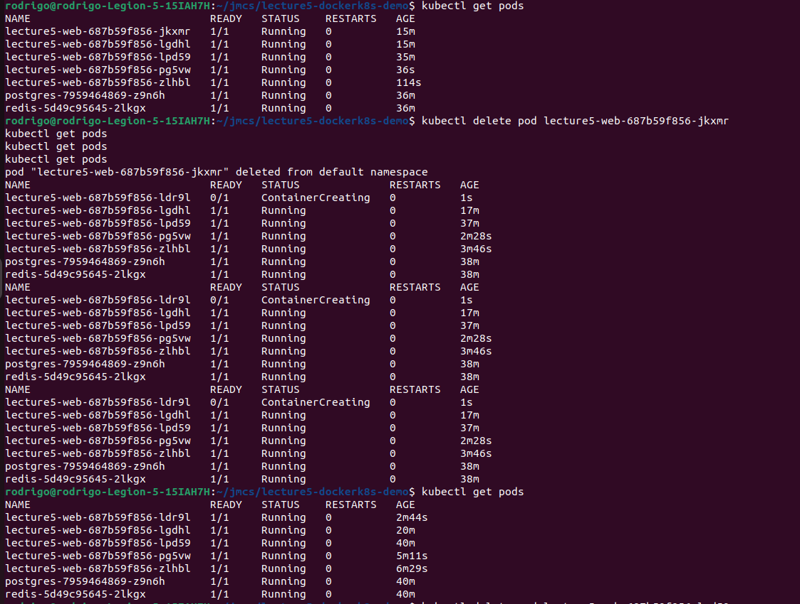

## Lecture 5 Exercises solution - [My fork](https://github.com/friaes/lecture5-dockerk8s-demo)

### Task 1a - Add Adminer Service

I added the new Adminer service to [docker-compose.yml](docker-compose.yml), based on the structure of the othe services.

Screenshot:



### Task 1b - Change Base Image to python:3.11-alpine

Implemented in [Dockerfile](Dockerfile).

- a) switched to `python:3.11-alpine`, nothing extra needed

- b) Built both versions and compared image sizes

Commands used:
```bash
docker build -t lecture5-webapp:slim .
docker build -t lecture5-webapp:alpine .
docker images
```
Results:
| Image | Size |
|---|---|
| lecture5-webapp:alpine | 127MB |
| lecture5-webapp:slim | 232MB |

Size difference: Alpine saved 105MB compared to slim, almost half.

- c) no issues encountered

### Task 2a - Image Tagging and Registry

Commands used:
```bash
docker build -t task-app:v1.0 .
docker login
docker tag task-app:v1.0 friaes/task-app:v1.0
docker push friaes/task-app:v1.0
```

Docker Hub username: `friaes`

Screenshot:



### Task 2b - Container Inspection

command 1: `docker compose logs web`
- Shows the logs of the web container, like application output, and the activity(GET/POST).

command 2: `docker inspect lecture5-web`
- Displays the JSON with information about the web container, such as status, network settings, environment variables, and configuration.

command 3:`docker stats`
- Shows the resource usage of running containers in real time,
including CPU, memory, disk usage, and network.

### Task 3a - Deploy application

Screenshots:




### Task 3b - Scale and test load balancing

The results showed that requests were automatically distributed across the 5 pods. The Service routes incoming requests between replicas to ensure availability and scalability.

Screenshot:



### Task 3c - Self-healing

Self healing is important because it ensures system reliability. If a pod fails or is
deleted, Kubernetes will automatically recreate it without manual intervention.

Screenshot:

